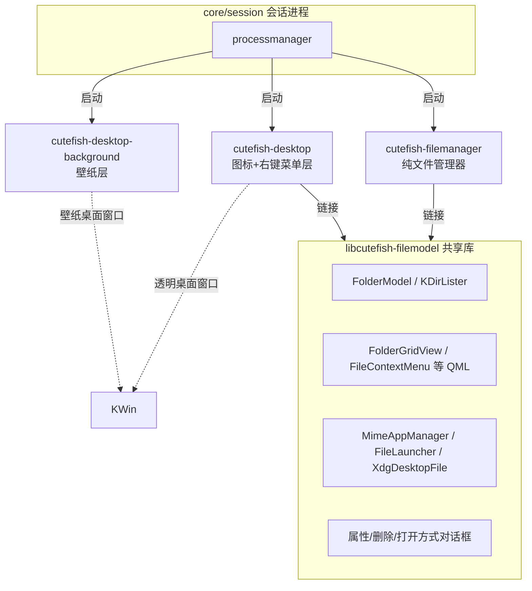
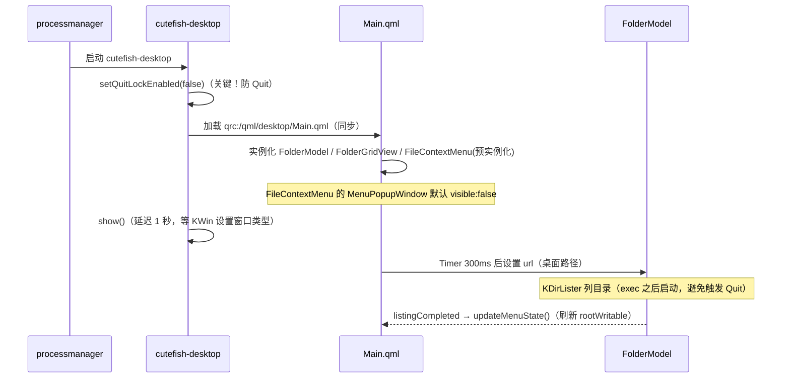
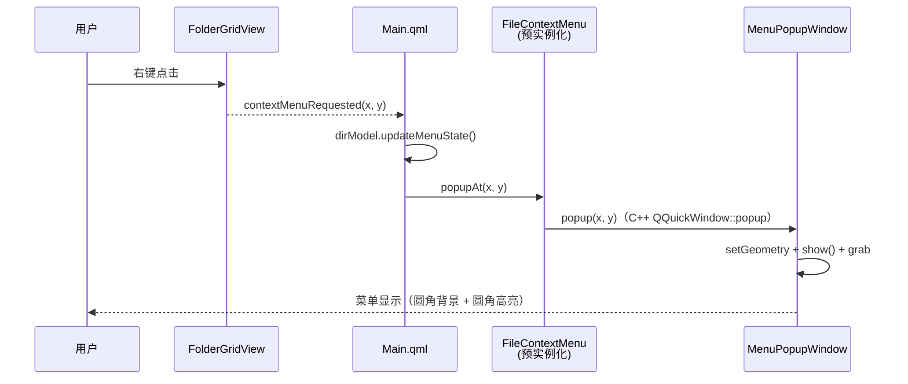
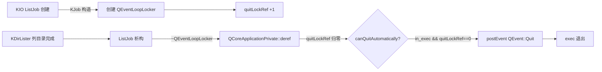
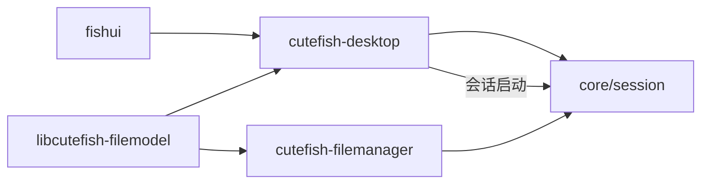

# CutefishOS 桌面进程重构与技术记录

> 最后更新：2026-08-06
> 本文档记录桌面右键菜单问题修复过程中的**架构重构**（`filemanager -d` → `cutefish-desktop` 独立进程
> + `libcutefish-filemodel` 共享库），以及迁移 Qt6/KF6 后遇到的关键技术问题与解决方案。
> 与《桌面与右键菜单架构.md》（旧版分层架构说明）配套阅读。

---

## 1. 背景

用户反馈桌面右键菜单存在 5 个问题：

| 问题 | 根因 | 状态 |
|---|---|---|
| 新建文件夹失败 | `rootWritable` 未刷新 → 菜单项禁用 | ✅ 已修复 |
| 打开终端无反应 | `MimeAppManager` 惰性初始化时序 → 终端列表为空 | ✅ 已修复 |
| 设置壁纸/显示设置打不开 | `cutefish-settings` 启动即收到 Quit 退出 | ✅ 已修复 |
| 菜单渲染方角 | MenuItem 默认矩形高亮 + 无圆角裁剪 | ✅ 已修复 |
| 菜单不弹出 | Loader 延迟加载时序（`item` 为 null） | ✅ 已修复 |

同时，原桌面模式寄生在 `filemanager -d` 中（职责/代码/进程/启动耦合），
迁移 Qt6/KWin6 后弹窗类型错误频发，最终拆分为**独立桌面进程 + 共享库**。

---

## 2. 新架构总览

### 2.1 进程架构



### 2.2 与旧架构对比

| 维度 | 旧架构 | 新架构 |
|---|---|---|
| 桌面图标进程 | `filemanager -d`（文件管理器附带） | `cutefish-desktop`（独立进程） |
| 文件模型 | filemanager 内部源码 | `libcutefish-filemodel` 共享库 |
| 右键菜单 | C++ QMenu（部分被注释） | QML `FileContextMenu`（统一机制） |
| 会话启动 | `cutefish-filemanager -d` | `cutefish-desktop` |
| 职责耦合 | 文件管理器必须带桌面模式 | 完全解耦，任一方崩溃互不影响 |

### 2.3 分层桌面（保持）

```
┌─────────────────────────────────────────────┐
│ 普通应用窗口                                │
├─────────────────────────────────────────────┤
│ cutefish-dock                               │
├─────────────────────────────────────────────┤
│ cutefish-desktop（图标 + 菜单层）           │ 背景透明，只画图标与右键菜单
├─────────────────────────────────────────────┤
│ cutefish-desktop-background（壁纸层）       │ 壁纸 / 纯色 / 暗色调暗
└─────────────────────────────────────────────┘
```

两层均为 `_NET_WM_WINDOW_TYPE_DESKTOP`，KWin 置于最底层堆叠区。

---

## 3. 共享库 libcutefish-filemodel

### 3.1 共享边界

位置：`code/filemodel/`，编译产物 `libcutefish-filemodel.so`。

| 模块 | 内容 |
|---|---|
| model/ | FolderModel、PlacesModel、PathBarModel、DirLister、Positioner |
| helper/ | FileLauncher、MimeAppManager 调用、DateHelper、ShortCut、PathHistory |
| mimetype/ | MimeAppManager、XdgDesktopFile |
| thumbnailer/ | ThumbnailProvider、ThumbnailCache |
| draganddrop/ | DeclarativeDropArea、MimeData、DragDropEvent |
| widgets/ | ItemViewAdapter、RubberBand |
| cio/ | CFileJob、CFileSizeJob |
| dialogs/ | 属性/删除/打开方式对话框（C++ 封装 QML） |
| qml/ | 共享 QML：FolderGridView、FileContextMenu、GlobalSettings 等 12 个文件 |
| images/ | 共享图标（59 个 SVG） |
| window.cpp | 文件管理器窗口类（QQuickView 子类） |

### 3.2 QML 类型注册机制（关键设计）

共享库内的 QML 组件（FolderGridView 等）**以文件形式注册为模块类型**：

```cpp
// registertypes.cpp
Q_INIT_RESOURCE(filemodel);  // 显式注册库内 qrc 资源

qmlRegisterType<FolderModel>("Cutefish.FileManager", 1, 0, "FolderModel");
// 共享 QML 组件：以文件注册（可靠方式）
qmlRegisterType(QUrl("qrc:/qml/FolderGridView.qml"), "Cutefish.FileManager", 1, 0, "FolderGridView");
qmlRegisterType(QUrl("qrc:/qml/FileContextMenu.qml"), "Cutefish.FileManager", 1, 0, "FileContextMenu");
// ... 共 6 个 QML 组件 + 8 个 C++ 类型 + DragDrop 模块
```

宿主进程（desktop / filemanager）启动时调用 `registerCutefishFileModelTypes()` 即可。

> ⚠️ 为什么不用 `import "qrc:/qml"` 目录导入？
> QML 引擎对 qrc 目录导入不稳定（实测每次报错点不同：FolderGridView / FolderGridItem /
> GlobalSettings / FileContextMenu 轮流报 "is not a type"）。`qmlRegisterType(QUrl(...))`
> 是 Qt 标准机制，可靠且与 C++ 类型共存无冲突。

### 3.3 资源管理

- 库资源文件命名为 **`filemodel.qrc`**（不要叫 `qml.qrc`！）
- 原因：宿主可执行文件也有 `qml.qrc`（qrc 名决定符号 `qInitResources_qml`），
  两个同名 qrc 导致 `Q_INIT_RESOURCE` 符号冲突——调用会解析到宿主自己的资源注册函数，
  库内资源（`qrc:/qml/FolderGridView.qml`）对宿主不可见。
- 改名后符号为 `qInitResources_filemodel`，无冲突。

---

## 4. 独立桌面进程 cutefish-desktop

位置：`code/desktop/`，产物 `/usr/bin/cutefish-desktop`。

### 4.1 职责

- 桌面图标（FolderGridView + FolderModel）
- 右键菜单（FileContextMenu，QML 统一机制）
- 多屏支持（每屏一个 DesktopView）
- 壁纸由 `cutefish-desktop-background` 提供（本层透明）

### 4.2 启动流程



### 4.3 右键菜单弹出流程



> ⚠️ Loader 时序：菜单必须**预实例化**（`active: true`）。延迟加载（`active: false`
> 右键时才激活）时 `item` 异步创建，立即调用 `popupAt()` 会因 `item` 为 null 静默失败。
---

## 5. 关键技术问题与解决方案

### 5.1 应用启动即退出（QEventLoopLocker 自动 Quit）⭐ 最重要

**现象**：`cutefish-desktop`、`cutefish-settings` 启动后 `exec()` 立即收到
`QEvent::Quit` 退出；`cutefish-filemanager` 偶发。表现为"设置程序打不开"。

**根因**（gdb + 反汇编 + LD_PRELOAD 逐层定位）：



- KJob（KDE 框架）用 `QEventLoopLocker` 保持应用存活（Job 运行时窗口关了也不退出）
- 迁移 Qt6/KF6 后，`QEventLoopLocker` 析构时若退出锁计数归零且事件循环在运行，
  会向主循环投递 `QEvent::Quit`
- 只要应用创建过 KIO Job（KDirLister 列目录）就会触发

**修复**：所有相关应用启动时禁用退出锁：

```cpp
// desktop/main.cpp、filemanager/main.cpp、settings/src/main.cpp
QCoreApplication::setQuitLockEnabled(false);
```

**验证**：settings 连续 3 次启动全部存活；desktop 稳定运行；gdb 确认 Quit 不再投递。

### 5.2 qrc 资源符号冲突

**现象**：库内 QML 组件在宿主进程中不可见（`qrc:/qml/FolderGridView.qml: No such file or directory`）。

**根因**：库与宿主可执行文件都叫 `qml.qrc` → 都导出 `qInitResources_qml` 符号。
ELF 符号解析优先可执行文件的符号，`Q_INIT_RESOURCE(qml)` 注册的是宿主自己的资源，
库的 qrc 从未注册。

**修复**：
- 库资源改名 `filemodel.qrc` → 符号 `qInitResources_filemodel`
- `registerCutefishFileModelTypes()` 内显式 `Q_INIT_RESOURCE(filemodel)`

### 5.3 QML 目录导入不稳定

**现象**：`import "qrc:/qml"` 后，FolderGridView / FolderGridItem / GlobalSettings /
FileContextMenu 轮流报 "is not a type"（每次运行报错点不同）。

**根因**：QML 引擎对 qrc 目录的 implicit/显式目录导入在跨 qrc 文件场景下不可靠。

**修复**：改用标准机制 `qmlRegisterType(QUrl("qrc:/qml/xxx.qml"), ...)` 把共享 QML
文件注册为模块类型（见 3.2）。

### 5.4 右键菜单不弹出

**现象**：桌面右键点击后菜单不出现（无任何错误日志）。

**根因**：Main.qml 中菜单用 `Loader { active: false }` 延迟加载。右键处理：

```qml
if (!desktopMenuLoader.active)
    desktopMenuLoader.active = true
desktopMenuLoader.item.popupAt(x, y)  // ← Loader 异步实例化，item 还是 null！
```

**修复**：Loader 改为 `active: true` 预实例化。MenuPopupWindow 窗口默认
`visible: false`，启动时创建无副作用，右键时 `item` 立即可用。

### 5.5 新建文件夹失败

**现象**：右键"新建文件夹"点击无反应（菜单项灰色禁用）。

**根因**：`FolderModel::rootWritable` 只在 `updateMenuState()` 中计算，而：
1. 旧桌面 Main.qml 中 `updateMenuState()` 调用被注释；
2. 列目录完成前 `rootItem()` 无效 → `rootWritable=false` → 菜单项 `enabled: false`。

**修复**（foldermodel.cpp）：

```cpp
QObject::connect(m_dirLister, myCompletedSignal, this, [this] {
    setStatus(Status::Ready);
    updateMenuState();   // 列目录完成立即刷新 rootWritable
    emit listingCompleted();
});
```

并恢复旧桌面 Main.qml 中被注释的 `FileContextMenu` + `Connections`。

### 5.6 打开终端无反应

**现象**：右键"Open in Terminal"后终端不启动。

**根因**：`MimeAppManager` 构造后延迟 100ms（QTimer）才扫描 `.desktop` 文件填充
`m_terminalApps`；若 `launchTerminal()` 在扫描前被调用（如右键很快），列表为空静默返回。

**修复**（mimeappmanager.cpp）：

```cpp
void MimeAppManager::launchTerminal(const QString &path)
{
    if (m_terminalApps.isEmpty())
        initApplications();   // 防御性补扫
    if (m_terminalApps.isEmpty())
        return;
    ...
}
```

另修复 `FileLauncher::startDetached`：D-Bus `com.cutefish.Session.launch` 调用失败时
校验 `QDBusPendingReply::isValid()` 并回退 `QProcess::startDetached`，避免静默失败。

### 5.7 设置程序打不开

**根因**：即 5.1 的 QuitLock 问题——`cutefish-settings` 启动即退出，并非
FileLauncher 调用失败。修复见 5.1。

### 5.8 菜单渲染方角

**现象**：点击菜单项时高亮背景是直角矩形，角超出菜单圆角。

**根因**：`FishUI.MenuItem` 继承 `T.MenuItem` 未定义 background（默认矩形高亮）；
菜单内容（ListView/ColumnLayout）只做矩形 clip，不做圆角裁剪。

**修复**（fishui）：
- `controls/MenuItem.qml`：自定义圆角高亮背景（`radius: 10`，pressed/hovered 半透明高亮色）
- `controls/DesktopMenu.qml`：内容容器加 `OpacityMask` 按背景圆角（`hugeRadius`）裁剪
- `fish-style/MenuItem.qml`：background 圆角与菜单背景统一

### 5.9 桌面进程 exec 前 KDirLister 触发 Quit（辅助结论）

实测：`exec()` 之前调用 `KDirLister::openUrl` 会让 Quit 事件在 `exec()` 首次
`sendPostedEvents` 时被处理；`exec()` 之后启动则正常。Main.qml 中 FolderModel 的
`url` 用 `Timer`（300ms，Item 级子对象）延迟设置，确保列目录发生在事件循环内。

---

## 6. 打包与部署

### 6.1 deb 打包

参考 `filemanager/debian/` 结构，新增两个包的 `debian/` 目录：

| 包 | 内容 | 关键点 |
|---|---|---|
| `libcutefish-filemodel` | `libcutefish-filemodel.so` → /usr/lib | `install` 加 `CMAKE_SOURCE_DIR` 条件：仅独立构建时安装（被 add_subdirectory 引用时不装，避免库重复进依赖包） |
| `cutefish-desktop` | `/usr/bin/cutefish-desktop` + autostart | Depends: `libcutefish-filemodel`、`fishui`、qml6-module-*；KIO/KF6 库依赖由 `${shlibs:Depends}` 自动生成 |

打包命令（单包）：

```bash
cd code/filemodel && dpkg-buildpackage -b -uc -us
cd code/desktop  && dpkg-buildpackage -b -uc -us
```

### 6.2 build_code.sh

`script/build_code.sh` 的 `git_repos` 新增 `filemodel`、`desktop` 两个条目。
流程：`mk-build-deps`（解析构建依赖）→ `dpkg-buildpackage -b -uc -us` → 产物移至
`output/debs/`（dbgsym 移至 `output/dbgsym/`）。

```bash
./script/build_code.sh filemodel   # 共享库
./script/build_code.sh desktop     # 桌面进程
./script/build_code.sh filemanager
./script/build_code.sh core        # 会话（启动 cutefish-desktop）
./script/build_code.sh fishui      # 渲染修复（圆角菜单）
```

### 6.3 部署顺序（依赖关系）



安装：

```bash
dpkg -i output/debs/libcutefish-filemodel_*.deb
dpkg -i output/debs/fishui_*.deb
dpkg -i output/debs/cutefish-desktop_*.deb
dpkg -i output/debs/cutefish-filemanager_*.deb
dpkg -i output/debs/cutefish-core_*.deb
```

### 6.4 会话接入

`core/session/processmanager.cpp` 的 `startDesktopProcess()`：

```cpp
// 旧：list << qMakePair(QString("cutefish-filemanager"), QStringList() << "-d");
// 新：独立桌面进程
list << qMakePair(QString("cutefish-desktop-background"), QStringList());
list << qMakePair(QString("cutefish-desktop"), QStringList());
```

---

## 7. 关键文件清单

| 文件 | 说明 |
|---|---|
| `code/filemodel/CMakeLists.txt` | 共享库构建（install 条件化） |
| `code/filemodel/registertypes.cpp` | QML 类型注册（C++ 类型 + QML 文件类型 + Q_INIT_RESOURCE） |
| `code/filemodel/filemodel.qrc` | 共享 QML + 59 个图标（勿改名 qml.qrc！） |
| `code/filemodel/model/foldermodel.cpp` | FolderModel：completed 刷新 updateMenuState |
| `code/filemodel/mimetype/mimeappmanager.cpp` | launchTerminal 防御性补扫 |
| `code/filemodel/helper/filelauncher.cpp` | D-Bus launch 失败回退 QProcess |
| `code/desktop/main.cpp` | 桌面进程入口（setQuitLockEnabled(false)） |
| `code/desktop/desktopview.cpp` | 桌面窗口（类型/透明/多屏） |
| `code/desktop/qml/desktop/Main.qml` | 桌面视图：FolderModel(Timer 延迟 url) + 预实例化菜单 |
| `code/filemanager/main.cpp` | setQuitLockEnabled(false) + 注册共享类型 |
| `code/filemanager/qml.qrc` | 精简为窗口专属 8 个文件 |
| `code/settings/src/main.cpp` | setQuitLockEnabled(false) |
| `code/core/session/processmanager.cpp` | 启动 cutefish-desktop |
| `code/fishui/src/controls/MenuItem.qml` | 圆角高亮背景 |
| `code/fishui/src/controls/DesktopMenu.qml` | OpacityMask 圆角裁剪 |

---

## 8. 验证记录（xvfb 环境）

| 项 | 结果 |
|---|---|
| cutefish-desktop 启动存活 | ✅ |
| 右键后进程存活 | ✅ |
| 菜单窗口出现（200x470 @ 右键位置） | ✅ |
| cutefish-filemanager 打开 /tmp | ✅ |
| cutefish-settings -m background 存活 | ✅（3 次） |
| newFolder 创建目录 | ✅（/tmp/nftest/New Folder） |
| launchTerminal 终端列表 | ✅（apps=3，含 cutefish-terminal） |
| QML 错误（desktop/filemanager） | 无 |

---

## 9. 遗留事项

- `cutefish-desktop` 的 Wayland 兼容性验证（当前 `KX11Extras::setType` 仅处理 xcb）
- `filemanager/qml/Desktop/`（旧桌面 QML）为死代码，可后续移除
- 共享库 `libcutefish-filemodel` 版本号 0.1，随发布调整

