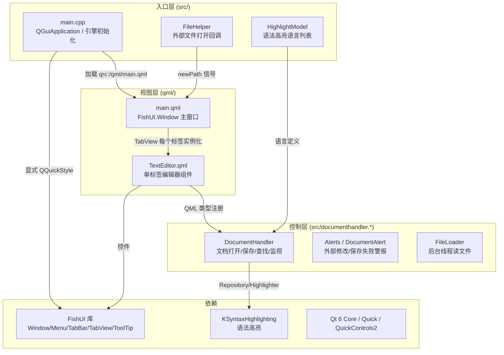
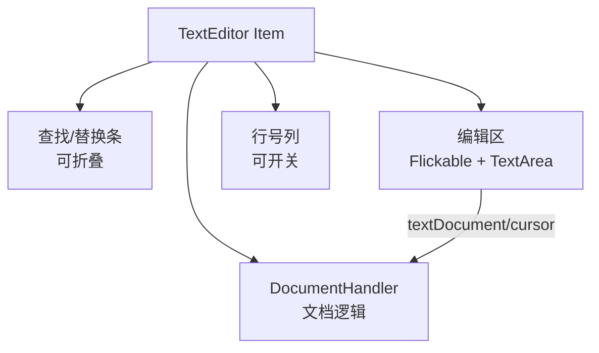
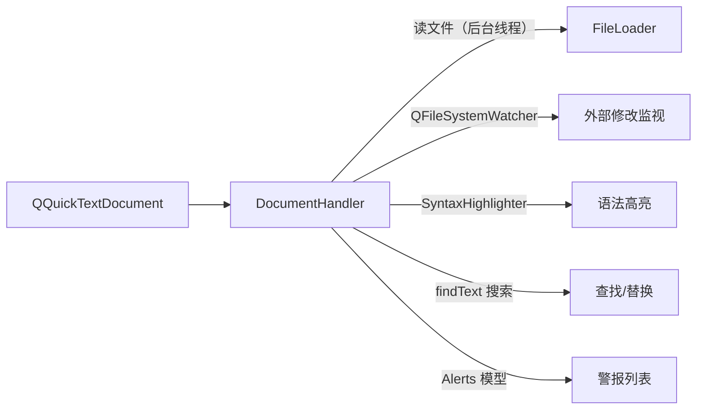
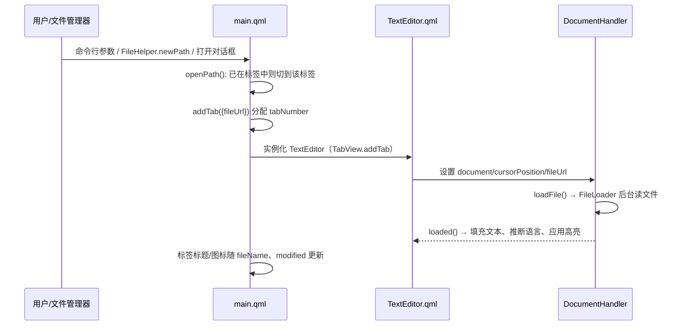
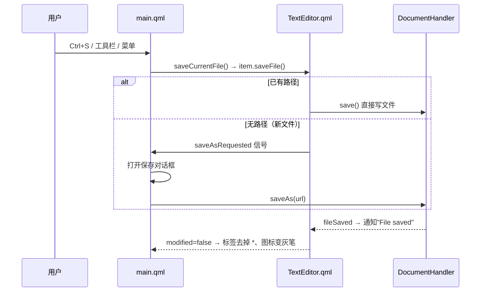

# Cutefish TextEditor 架构设计

> 最后更新：2026-08-11
> 本文档描述 **cutefish-texteditor**（CutefishOS 自带文本编辑器）的整体架构：
> 技术栈、模块划分、界面层次与数据流。配套阅读《核心流程.md》《功能清单.md》。

---

## 1. 技术栈与定位

| 项 | 值 |
|---|---|
| 语言 / 框架 | C++17 + Qt 6（Qt Quick / QQC2）+ QML |
| 界面风格 | `FishUI.Window` + fish-style 主题（与 desktop/dock/filemanager 一致） |
| 语法高亮 | KF6SyntaxHighlighting（KSyntaxHighlighting::Repository / SyntaxHighlighter） |
| 渲染后端 | 默认软件渲染（VMware/Mesa 虚拟显卡下 OpenGLRhi 失效，main.cpp 强制 software） |
| 打包 | CMake + debian/（dpkg-buildpackage） |
| 入口 | `cutefish-texteditor [文件...]` / `-f 文件` / 文件管理器关联（FileHelper） |

---

## 2. 总体架构图



---

## 3. 模块说明

### 3.1 入口层

| 模块 | 职责 | 关键点 |
|---|---|---|
| `main.cpp` | 应用入口 | ① 强制软件渲染（`QT_QUICK_BACKEND` 为空时）；② 启动时**删除本应用 QML 磁盘缓存**（升级后旧缓存会导致 QML 加载异常/段错误）；③ 显式 `QQuickStyle::setStyle("fish-style")`（否则 QQC2 回退 Basic demo 样式）；④ 按优先级挑选图标主题（cutefish → Crule → …）；⑤ 解析命令行文件路径写入 `commandLineFiles` 上下文属性；⑥ 注册 QML 类型（`DocumentHandler`、`FileHelper`） |
| `texteditor.cpp/h` | `FileHelper` | 供文件管理器/桌面通过 `Q_INVOKABLE addPath()` 把外部文件路径传入，发射 `newPath` 信号 |
| `highlightmodel.cpp/h` | `HighlightModel` | 枚举 KSyntaxHighlighting 定义（当前应用在 C++ 侧尚未启用，语言列表由 DocumentHandler 静态方法提供） |

### 3.2 视图层

**`main.qml`（主窗口）** —— 自顶向下布局（Notepad++ 风格）：

```mermaid
graph LR
    A[FishUI.Window<br/>960x640] --> B[菜单栏<br/>File/Edit/Search/View]
    A --> C[工具栏<br/>新建/打开/保存 | 撤销/重做 | 剪切/复制/粘贴]
    A --> D[标签栏<br/>FishUI.TabBar + TabButton]
    A --> E[编辑区<br/>FishUI.TabView 承载各标签]
    A --> F[状态栏<br/>行列/字符数/语言/编码/缩放]
```

| 部件 | 实现 | 说明 |
|---|---|---|
| 菜单栏 | `Row + Repeater + Button` | 下拉 `FishUI.Menu`，菜单沿按钮下沿弹出（`mapToItem` 修正 header 偏移） |
| 工具栏 | `Row + ToolButton` | 26px 紧凑图标按钮，分组分隔线，ToolTip 提示 |
| 标签栏 | `FishUI.TabBar` + `TabButton` delegate | 标签文字带未保存 `*`；图标区分保存（灰笔）与未保存（红笔）；双击空白新建标签；右键弹出标签菜单 |
| 编辑区 | `FishUI.TabView`（Container） | 每个标签实例化 `TextEditor` 组件；关闭最后一个标签后**直接退出程序** |
| 状态栏 | `Row + Label` | 实时显示当前文档统计 |
| 对话框 | 自定义居中覆盖层 | 关闭标签/退出程序的未保存确认（不保存/保存/取消 + 右上角 ×） |
| 打开/保存 | `FileDialog` / 自定义保存对话框 | 支持文件名过滤与目录选择 |

**`TextEditor.qml`（单标签）**：



| 部件 | 说明 |
|---|---|
| 查找/替换条 | `Ctrl+F` 查找 / `Ctrl+H` 替换；支持区分大小写、全词匹配；替换模式显示第二行 |
| 编辑区 | 显式 `Flickable + TextArea`（不用 ScrollView，软件渲染下文字渲染异常） |
| 行号 | 可开关（View 菜单）；与文字滚动联动 |
| 缩放 | `zoomScale` 控制 `font.pointSize = baseFontSize * zoomScale` |
| 字体 | `monoFont` 属性 + fonts.js 缓存系统等宽字体列表 |

### 3.3 控制层（DocumentHandler）



核心职责：
- **文件 IO**：`loadFile()` / `saveAs()` / `save()`；UTF-8 优先、Latin1 回退；保存后发射 `fileSaved`
- **修改跟踪**：`m_internallyModified`（编辑触发）/ `m_externallyModified`（外部改文件）；`modified` 属性驱动标签 `*` 与图标
- **外部修改监视**：`QFileSystemWatcher` 监听文件；文件被改/被删 → 生成 `DocumentAlert`（Reload / Auto Reload / Ignore；或 Save）
- **查找替换**：`findText()` 定位并发射 `searchFound(start,end)` 让 QML 选中滚动到可见；`replaceText` / 全局替换
- **语法高亮**：按文件名推断语言（`definitionForFileName`），应用主题（Breeze Light/Dark），`refreshAllBlocks()` 刷新布局

---

## 4. 关键数据流

### 4.1 打开文件



### 4.2 保存



---

## 5. 与 FishUI 的依赖关系

| FishUI 组件 | 使用位置 | 备注 |
|---|---|---|
| `FishUI.Window` | main.qml 根窗口 | 无边框、圆角、标题栏、Header |
| `FishUI.TabBar` / `TabButton` / `TabCloseButton` | 标签栏 | 标签图标、关闭按钮、选中线框 |
| `FishUI.TabView` | 编辑区容器 | Container 子类，修复 addTab 尺寸绑定 |
| `FishUI.Menu` / `MenuItem` / `MenuSeparator` | 菜单栏/右键菜单 | 贴按钮下沿弹出 |
| `FishUI.ToolButton` / `RoundImageButton` / `ToolTip` | 工具栏/查找条 | 26px 紧凑按钮 |
| `FishUI.Theme` / `Units` | 全界面配色与间距 | 亮/暗色主题 |

> FishUI 侧针对 texteditor 联动做过的底层修复：软件渲染下 layer+OpacityMask 失效（Window/Menu/Dialog/ToolTip 改用边框背景）、TabView addTab 尺寸绑定、CheckIndicator 勾选图标、TabBar blankDoubleClicked 信号等，详见 fishui 源码与《右键菜单样式与图标系统.md》。
