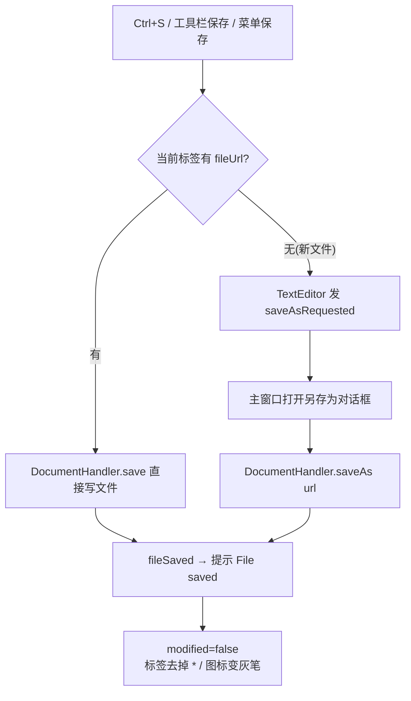
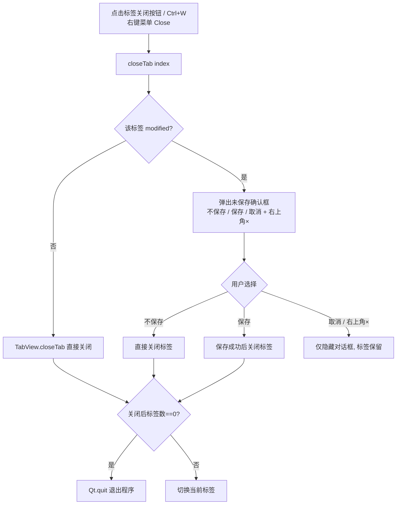
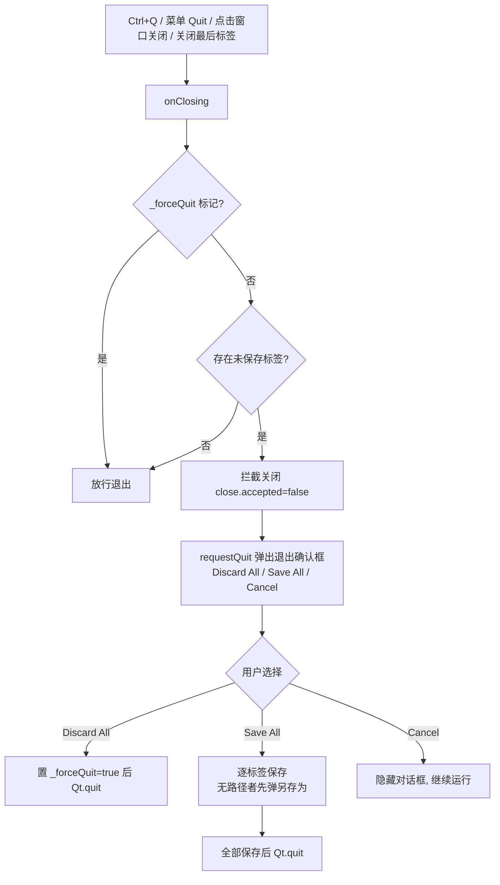
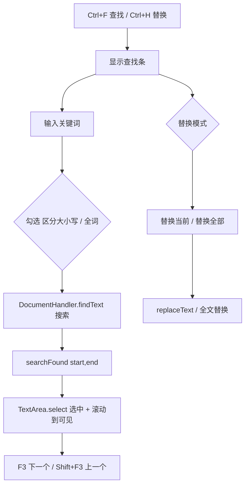
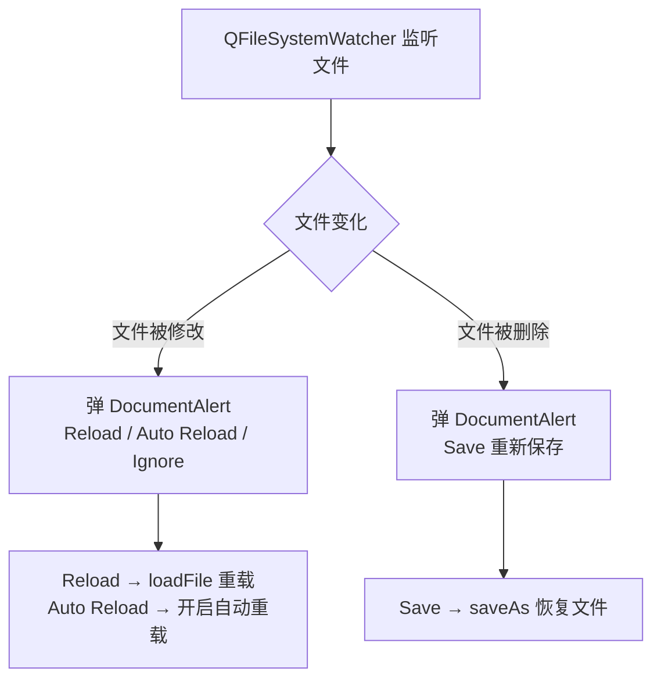
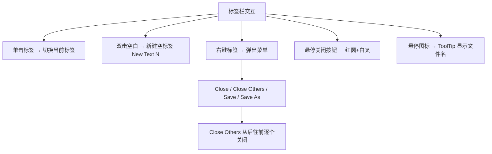

# Cutefish TextEditor 核心流程

> 最后更新：2026-08-11
> 本文档描述 cutefish-texteditor 的关键交互流程：启动、打开文件、保存/另存为、
> 关闭标签（含未保存确认）、退出程序（含未保存保护）、查找/替换、外部修改处理。

---

## 1. 启动流程

```mermaid
flowchart TD
    A[main() 入口] --> B{设置 QT_QUICK_BACKEND?}
    B -- 空 --> C[强制 software 渲染]
    B -- 已设置 --> D[尊重环境变量]
    C --> E[删除本应用 QML 磁盘缓存<br/>qmlcache]
    D --> E
    E --> F[QQuickStyle::setStyle fish-style]
    F --> G[设置图标主题搜索路径与主题]
    G --> H[解析命令行文件参数<br/>-f file 或裸路径]
    H --> I[加载 qrc:/qml/main.qml]
    I --> J{有命令行文件?}
    J -- 有 --> K[逐文件 openPath 打开标签]
    J -- 无 --> L[新建一个空标签 New Text N]
    K --> M[窗口显示]
    L --> M
```

**要点**：
- 软件渲染：VMware/Mesa 下 Qt6 默认 OpenGLRhi 无法渲染（窗口全黑），必须在 QGuiApplication 创建前调用。
- 删除 QML 缓存：应用升级后旧 `.qmlc` 字节码与新版不兼容，实测会 QML 加载异常/段错误。
- `QQuickStyle::setStyle` 必须在 `engine.load()` 之前，否则 QQC2 回退到 Basic demo 样式。

---

## 2. 打开文件流程

```mermaid
flowchart TD
    A[触发方式: 命令行参数 / FileHelper.newPath<br/>Ctrl+O 打开对话框 / 拖放] --> B[openPath path]
    B --> C{已在标签栏打开?}
    C -- 是 --> D[切换到已有标签 currentIndex=i]
    C -- 否 --> E[addTab fileUrl]
    E --> F[实例化 TextEditor]
    F --> G[DocumentHandler 设置 document]
    G --> H[FileLoader 后台线程读文件<br/>UTF-8 解码, 失败回退 Latin1]
    H --> I[loaded 信号 → 填充 TextArea]
    I --> J[按文件名推断语言并应用高亮]
    J --> K[标签显示文件名, 图标=灰笔(已保存)]
```

**要点**：同一文件已打开时不重复开标签，直接切换；`FileHelper` 供文件管理器"打开方式"调用。

---

## 3. 保存 / 另存为流程



**另存为（Ctrl+Shift+S）** 等同上面的无路径分支，强制弹对话框。

---

## 4. 关闭标签流程（含未保存确认）



**要点**：
- 关闭最后一个标签 → **直接退出程序**（不再新建空标签，避免"New Text N"编号无限上涨）。
- 未保存确认框是自定义居中覆盖层（三个按钮 + 右上角关闭，点击 × 等价取消）。

---

## 5. 退出程序流程（未保存保护）



**要点**：`saveAllAndQuit` 通过 `_pendingSaveTabs` 队列逐个保存；无路径的新文件会先弹另存为，保存完再继续队列，全部完成后才真正退出。

---

## 6. 查找 / 替换流程



**要点**：查找条支持回车查找下一个、Esc 收起；替换模式显示第二行输入替换文本。

---

## 7. 外部修改处理



---

## 8. 标签页交互流程



**要点**：标签标题 = 文件名 +（未保存 `*`）；图标区分保存状态（灰笔=已保存，红笔=未保存）；选中标签有蓝色背景+线框。
